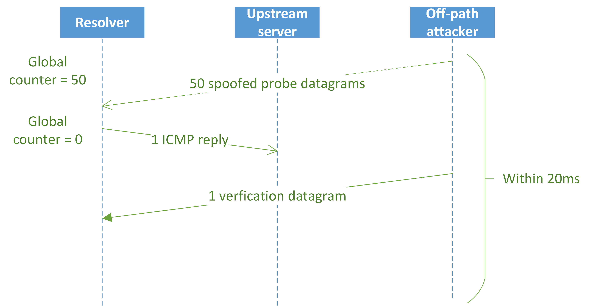
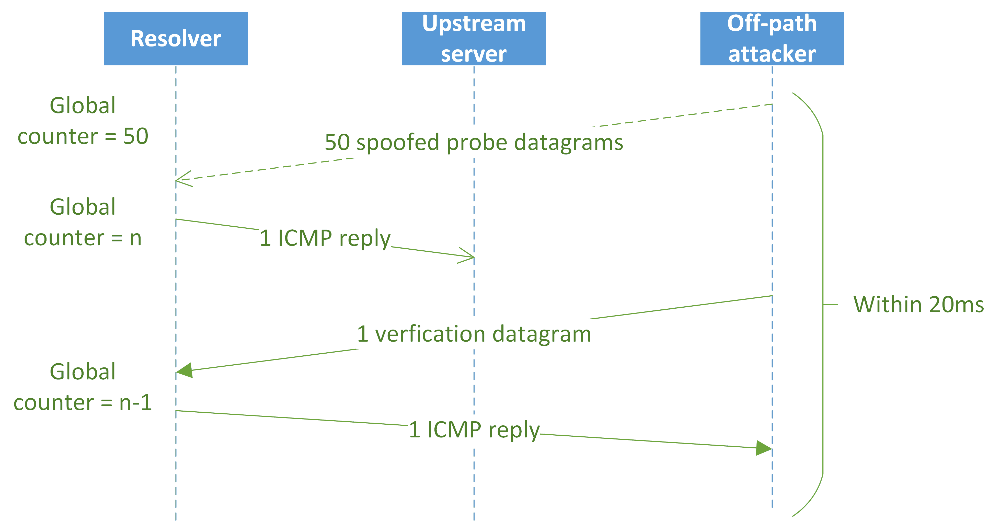
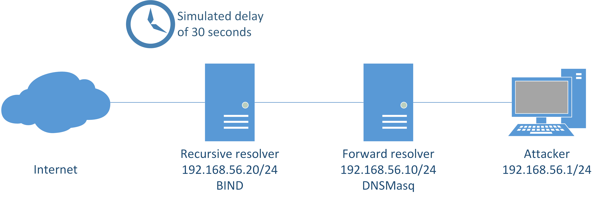
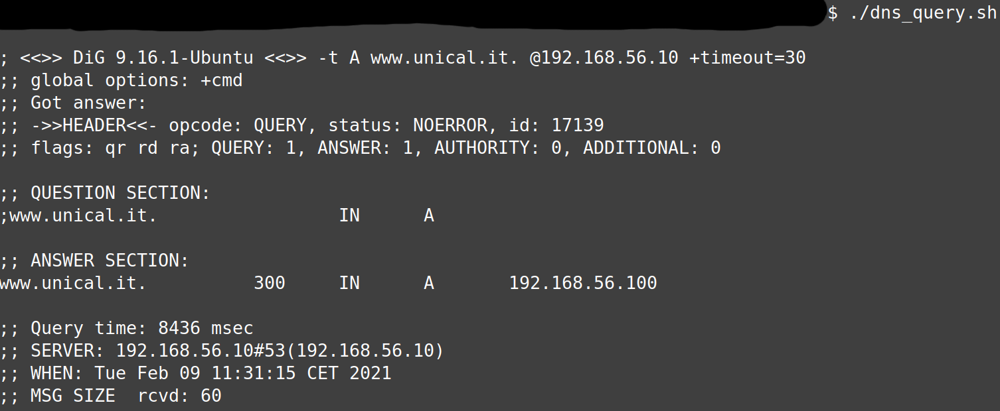
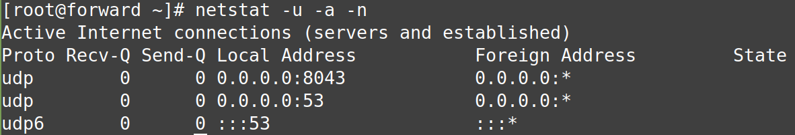
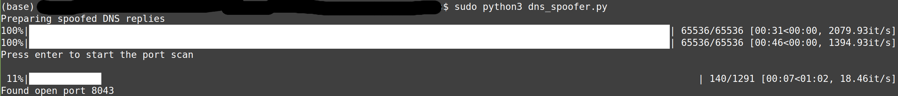

# SadDNS

This repository attempts to reproduce crucial parts of the [SadDNS](https://www.saddns.net/) attack.
In particular, the repository contains a Python script for performing the novel UDP port scan which exploits the Linux kernel's insufficient randomisation of the ICMP error rate limit parameters to determine an open UDP port on a DNS resolver.
Once the open UDP source port on the resolver has been found, malicious DNS answers, which try to guess the DNS transaction ID, are sent to the DNS resolver.

## Background

SadDNS is a revival of the classical DNS cache poisoning attack, in which an off-path attacker tries to guess the transaction ID of a DNS query in order to inject a malicious answer before the legitimate answer from the DNS server arrives.
SadDNS circumvents the protections offered by source port randomisation by employing a divide and conquer strategy using a novel UDP port scanning approach:

1. First, the UDP source port is determined, which requires about 2^16 UDP ports to be scanned.
2. Next, the spoofed DNS answers are sent in order to guess the transaction ID which again requires 2^16 transaction IDs to be guessed.

Therefore, the search space is limited to 2^16 + 2^16 = 2^17.

### UDP Port Scan Exploiting ICMP Error Rate Limiting

The novel UDP port scanning approach exploits a [use of insufficiently random values (CWE-330)](https://cwe.mitre.org/data/definitions/330.html).
The Linux kernel uses fixed values for the global ICMP error rate limit parameters; the number of ICMP error replies that can be sent out per second is set to 1,000 error replies per second, with a maximum batch size of 50 error replies, a recovery rate of 1 token per millisecond which starts after an initial delay of 20 milliseconds.

In order to exploit, the attacker sends 50 (maximum allowable batch size) spoofed UDP probes using the DNS server's IPv4 address to the DNS resolver.
The spoofed IPv4 address mitigates the protection offered by "connected" UDP sockets, in which the application advises the operating system to only forward UDP datagrams coming from a particular source IP address and source port to be forwarded.
If there is no open port in the range of the 50 scanned ports, the global rate limit counter is reduced by 50 to the value of 0.
Having sent the spoofed UDP probe datagrams, the attacker sends a verification UDP probe datagram using the attacker's original IP address to the DNS resolver; the destination port of this verification UDP probe datagram is a port that is closed almost certainly, like port 0.
As the global ICMP rate limit counter has a value of 0, no ICMP port unreachable message is sent to the attacker.
Thus, the attacker knows that the port is closed.

If at least one port in the range of 50 scanned ports is open, as is the case in the sequence diagram below, the global rate limit counter is decreased to a value `n`, whereat `n` denotes the number of open ports and is greater than 0 (`n > 0`).
Once the attacker sends the verification UDP probe datagram to the almost certainly closed port, an ICMP port unreachable message will be sent to the attacker indicating that there is at least one open port in the range.

If the attacker detected an open port in the range, binary search on the range can be performed to narrow the range down to one open port.
In order to achieve the required batch size of 50, padding probe UDP datagrams which poll the almost certainly closed port are added.
For more details (and a better explanation), please see the excellent SadDNS paper.

## Tests

### Test Setup

The script was tested on the architecture shown in the figure below.
This architecture models a simplified version of the attack on the forward resolver described in the SadDNS paper.
The forward resolver runs DNSMasq and communicates with a recursive resolver that runs BIND.
Only the recursive resolver is connected to the Internet.
In order to simulate the slowdown of the link, the Linux kernel's traffic control utility is used to introduce a delay of 10s or 30s.
The command for configuring traffic control is shown in the script `add_delay.sh`.

In order to perform the attack, the attacker starts a DNS query -- as shown in the script `dns_query.sh` -- and then runs the script `dns_spoofer.py` in order to determine the UDP source port of the forward resolver.
Once the UDP source port has been found out, the malicious DNS answers are injected.

As targets, the servers run CentOS 8.1 with kernel version 4.18.0-147.el8.x86_64.
In order to allow ICMP error replies, the firewall was disabled.

### Test Results

In order to test the scripts, the FQDN `www.unical.it.` should be resolved to the IPv4 address `192.168.56.100`.
These coordinates are set in the script `dns_spoofer.py`.

The image below shows that the FQDN `www.unical.it.` was successfully spoofed to be resolved to the IPv4 address `192.168.56.100`.

On the forward resolver, the open port can be found using the command `netstat -u -a -n`.
It can be seen that the DNSMasq server listens for queries on port 53 using both IPv4 and IPv6.
In addition, there is an UDP socket on port 8043 which is used by the DNSMasq forward resolver to query the BIND recursive resolver.

As can be seen in the output of the DNS spoofer below, the open port was successfully determined to be 8043, the same port shown by the `netstat` command.

